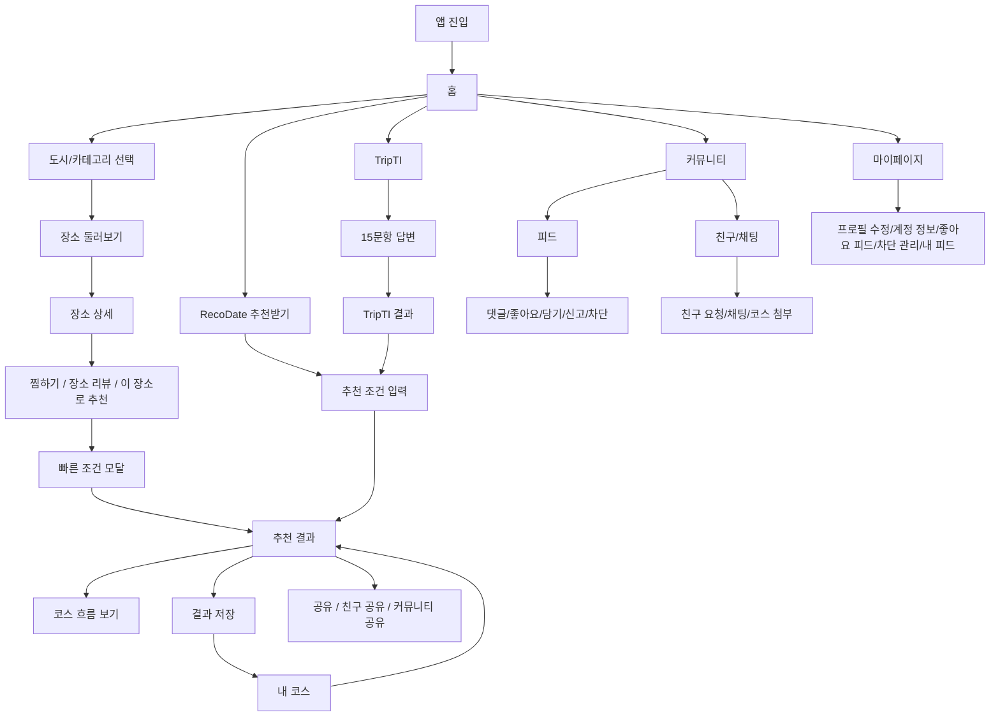
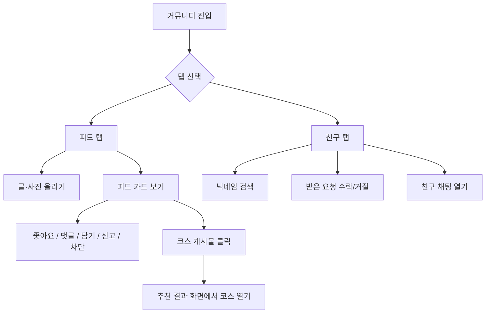
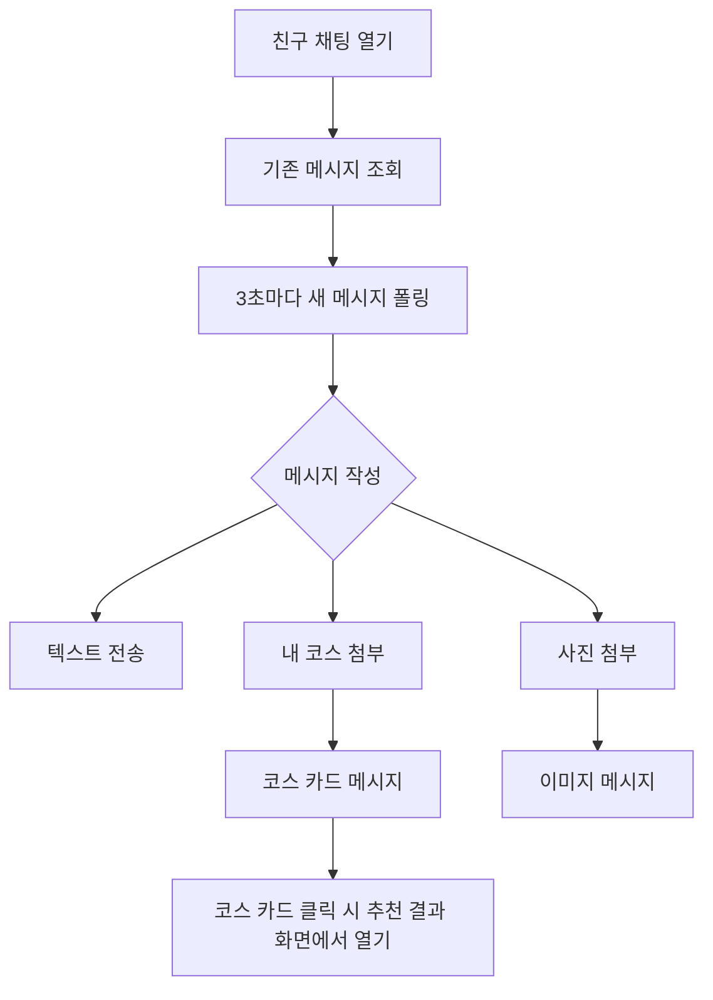
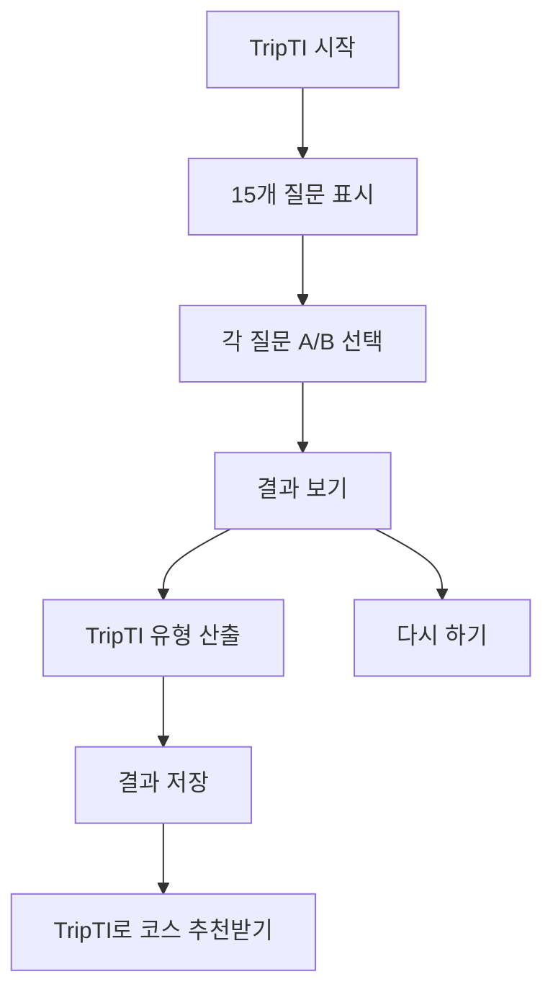
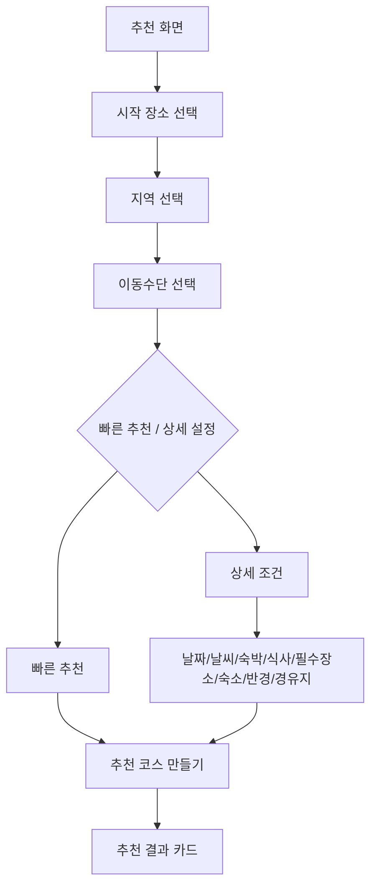

# RecoDate 전체 화면/기능/버튼/흐름 명세

작성일: 2026-06-12  
기준 코드: `frontend/index.html`, `frontend/app.js`, `frontend/styles.css`  
목적: 앱의 모든 화면, 모달, 동적 카드, 버튼, 작은 보조 기능까지 빠짐없이 확인하기 위한 프론트 기능 명세서

## 0. 전체 구조

RecoDate는 하나의 정적 프론트 앱 안에서 여러 `portal-view` 화면을 숨김/표시하는 방식으로 동작한다. 화면 이동은 대부분 `data-show-view` 버튼이 담당하고, 모달은 `hidden` 속성을 켜고 끄는 방식이다.

주요 화면:

- 홈
- 커뮤니티
- TripTI
- 장소 둘러보기
- 찜한 장소
- 내 코스
- 마이페이지
- 로그인/회원가입
- 코스 추천

주요 모달/시트:

- 사용자 프로필 모달
- 친구 목록 모달
- 친구에게 코스 공유 모달
- 좋아요 누른 피드 모달
- 계정 정보 모달
- 댓글 바텀시트
- 신고 모달
- 차단 사용자 모달
- 채팅 모달
- 글·사진 올리기 모달
- 커뮤니티 코스 공유 모달
- 빠른 코스 조건 모달
- 지역 선택 모달
- 시작 장소 선택 모달
- 장소 상세 모달

## 1. 앱 공통 디자인

### 디자인 언어

- 전체 톤은 밝은 화이트/핑크 계열의 데이트 앱 분위기다.
- 브랜드 로고는 `Rec♡Date` 형태이며 하트 SVG를 브랜드 심볼로 쓴다.
- 주요 CTA는 핑크 계열 `primary-button`, 보조 버튼은 흰색/회색 계열 `secondary-button`을 사용한다.
- 화면은 카드, 패널, 세그먼트 버튼, 리스트 카드, 바텀시트, 모달 카드로 구성된다.
- 모바일 대응을 고려해 하단/중앙 모달, 카드형 리스트, 큰 터치 영역을 사용한다.
- 일부 커뮤니티/댓글/채팅 UI는 인스타그램식 피드·댓글·DM 흐름을 참고한 형태다.

### 공통 이동 버튼

| 버튼 | 위치 | 기능 |
|---|---|---|
| `Rec♡Date` 로고 | 상단 헤더 | 홈 화면으로 이동 |
| 홈 | 상단 내비게이션 | 홈 화면으로 이동 |
| 커뮤니티 | 상단 내비게이션 | 커뮤니티 화면으로 이동 |
| 코스 추천 | 상단 내비게이션 | 추천 조건 화면으로 이동 |
| TripTI | 상단 내비게이션 | TripTI 화면으로 이동 |
| 찜 | 상단 내비게이션 | 찜한 장소 화면으로 이동 |
| 내 코스 | 상단 내비게이션/플로팅 버튼 | 저장한 코스 화면으로 이동 |
| 로그인 | 상단 내비게이션 | 로그인 화면으로 이동 |
| 마이페이지 | 로그인 후 상단 내비게이션 | 마이페이지 화면으로 이동 |
| `← 메인 화면으로 돌아가기` | 각 주요 화면 상단 | 홈 화면으로 이동 |

### 공통 상태/보조 기능

- 로그인 토큰이 있으면 로그인 버튼 대신 마이페이지 버튼을 보여준다.
- 비로그인 상태에서 인증이 필요한 기능을 누르면 로그인 화면으로 보낸다.
- 하단/상단 커뮤니티 버튼에는 안 읽은 채팅 배지가 붙을 수 있다.
- 모바일 앱 환경에서는 상태바 색상, 뒤로가기 버튼, 모달 닫기 흐름을 별도로 처리한다.
- `Esc` 키로 댓글 시트가 열린 상태이면 닫을 수 있다.

## 2. 전체 사용자 흐름

## 3. 홈 화면

### 디자인

- 큰 히어로 영역에 `오늘의 데이트, 어느 도시에서 시작할까요?` 문구와 브랜드 CTA가 있다.
- TripTI 카드, 지역 선택 그리드, 카테고리 그리드, 홈 커뮤니티 피드가 이어진다.
- 지역 버튼은 둥근 카드형 버튼이고, 선택된 지역은 강조된다.

### 기능

- 앱의 시작 허브 역할을 한다.
- 도시/지역을 선택하면 해당 지역 기준으로 장소 카테고리 섹션이 열린다.
- 카테고리를 누르면 장소 둘러보기 화면으로 이동한다.
- 최근 커뮤니티 피드 일부를 홈에 노출한다.

### 버튼/컨트롤

| 버튼/컨트롤 | 기능 |
|---|---|
| `RecoDate 나만의 코스 추천받기` | 코스 추천 화면으로 이동 |
| `TripTI 여행 취향 테스트` | TripTI 화면으로 이동 |
| 지역 버튼 `전국, 서울, 부산, 대구, 인천, 광주, 대전, 울산, 세종, 경기, 강원, 충청도, 전라도, 경상도, 제주` | 둘러보기 기준 지역 선택 |
| 카테고리 `전체` | 선택 지역의 전체 장소 조회 |
| 카테고리 `음식점` | 음식점 장소 조회 |
| 카테고리 `카페` | 카페 장소 조회 |
| 카테고리 `야외 액티비티` | 야외 장소 조회 |
| 카테고리 `실내 액티비티` | 실내 활동 장소 조회 |
| 카테고리 `문화/전시` | 문화/전시 장소 조회 |
| 카테고리 `마무리/산책` | 산책/마무리 장소 조회 |
| 카테고리 `술집` | 술집 장소 조회 |
| `전체 보기 ›` | 커뮤니티 화면으로 이동 |
| 홈 커뮤니티 피드 카드 | 코스 게시물이면 코스 상세 열기, 일반 글이면 피드 동작 수행 |

## 4. 커뮤니티 화면

### 디자인

- 상단에 커뮤니티 제목과 설명이 있고, `친구 / 피드` 세그먼트 탭이 있다.
- 피드는 카드형 게시물 리스트다.
- 친구 탭은 검색창, 받은 요청, 친구 리스트로 구성된다.

### 흐름

### 피드 탭 버튼/기능

| 버튼/컨트롤 | 기능 |
|---|---|
| `친구` 탭 | 친구 검색/요청/채팅 패널 표시 |
| `피드` 탭 | 커뮤니티 피드 패널 표시 |
| `+ 글·사진 올리기` | 글·사진 올리기 모달 열기 |
| 필터 `전체` | 전체 공개 및 볼 수 있는 피드 조회 |
| 필터 `친구` | 친구 공개/친구 범위 피드 조회 |
| 정렬 `최신순` | 최신 게시물 기준 정렬 |
| 정렬 `인기순` | 좋아요/인기 기준 정렬 |
| 코스 피드 카드 | 코스 상세를 추천 결과 화면에서 열기 |
| `내 코스로 담기` | 해당 코스 JSON을 내 코스 localStorage에 저장 |
| 좋아요 버튼 | 게시물 좋아요 토글 |
| 댓글 버튼 | 댓글 바텀시트 열기 |
| 삭제 버튼 | 내 게시물 삭제 |
| 신고 버튼 | 신고 모달 열기 |
| 차단 버튼 | 작성자 차단 후 피드에서 숨김 |
| 프로필/작성자 영역 | 사용자 프로필 모달 열기 |

### 친구 탭 버튼/기능

| 버튼/컨트롤 | 기능 |
|---|---|
| 닉네임 검색 입력 | 검색어 입력 |
| `검색` | 사용자 검색 API 호출 |
| 검색 결과 사용자 행 | 사용자 프로필 모달 열기 |
| `친구 요청` | 해당 사용자에게 친구 요청 |
| `수락` | 받은 친구 요청 수락 |
| `거절` | 받은 친구 요청 거절 |
| 친구 행 채팅 버튼 | 해당 친구와 채팅 모달 열기 |
| 친구 행 프로필 영역 | 사용자 프로필 모달 열기 |
| 안 읽음 배지 | 친구별 안 읽은 채팅 수 표시 |

## 5. 글·사진 올리기 모달

### 디자인

- 중앙 카드형 모달.
- 텍스트 입력, 사진 첨부 버튼, 공개 범위 세그먼트, 하단 액션 버튼으로 구성된다.

### 버튼/기능

| 버튼/컨트롤 | 기능 |
|---|---|
| 내용 입력창 | 글 본문 입력, 최대 500자 |
| `사진 찍기` | 카메라 파일 입력 열기 |
| `갤러리에서 선택` | 사진 파일 선택 열기 |
| 사진 미리보기 `×` | 선택한 사진 제거 |
| 공개 범위 `전체 공개` | public 피드로 게시 |
| 공개 범위 `친구만` | friends 피드로 게시 |
| `취소` | 모달 닫기 |
| `올리기` | 글/사진 게시물 생성 |
| 우상단 `×` | 모달 닫기 |
| 바깥 배경 클릭 | 모달 닫기 |

## 6. 댓글 바텀시트

### 디자인

- 모바일 댓글창처럼 아래에서 올라오는 시트 형태다.
- 상단 그립, 제목, 닫기 버튼, 댓글 목록, 빠른 이모지 바, 입력창으로 구성된다.

### 버튼/기능

| 버튼/컨트롤 | 기능 |
|---|---|
| 상단 그립 | 댓글 시트 닫기 |
| 우상단 `×` | 댓글 시트 닫기 |
| 댓글 목록 | 댓글과 작성자, 시간, 삭제/신고/답글 동작 표시 |
| `답글 달기` | 입력창에 `@닉네임` 멘션 삽입 |
| 댓글 안의 `@아이디/닉네임` | 해당 사용자 프로필 열기 |
| 내 댓글 삭제 | 내 댓글 삭제 |
| 댓글 신고 | 신고 모달 열기 |
| 빠른 반응 `💗 🙌 🔥 👏 🥹 😍 😮 😂` | 입력창에 이모지 삽입 |
| 댓글 입력창 | 최대 300자 댓글 작성 |
| 종이비행기 버튼 | 댓글 등록 |
| 바깥 배경 클릭 | 댓글 시트 닫기 |
| `Esc` | 댓글 시트 닫기 |

## 7. 사용자 프로필 모달

### 디자인

- 사용자 아바타, 닉네임, TripTI, 통계, 액션 버튼, 공유한 피드 목록을 보여주는 모달이다.

### 버튼/기능

| 버튼/컨트롤 | 기능 |
|---|---|
| 우상단 `×` | 모달 닫기 |
| 통계 `피드` | 작성 게시물 수 표시 |
| 통계 `친구` | 친구 수 표시 |
| 통계 `받은 하트` | 받은 좋아요 수 표시 |
| `친구 요청` | 상대에게 친구 요청 |
| `수락` | 상대 요청 수락 |
| `거절` | 상대 요청 거절 |
| `채팅하기` | 채팅 모달 열기 |
| `친구 끊기` | 친구 관계 삭제 |
| `차단` | 사용자 차단 |
| `차단 해제` | 차단 해제 |
| `신고` | 사용자 신고 모달 열기 |
| 공유한 피드 카드 | 코스 게시물인 경우 코스 상세 열기 |

## 8. 채팅 모달

### 디자인

- DM 형태의 대화창.
- 상단 친구 아바타/닉네임, 메시지 영역, 코스 선택 패널, 사진 메뉴, 첨부 미리보기, 입력창으로 구성된다.

### 흐름

### 버튼/기능

| 버튼/컨트롤 | 기능 |
|---|---|
| 친구 아바타 | 채팅 닫고 사용자 프로필 모달 열기 |
| 코스 첨부 아이콘 | 저장한 내 코스 목록 열기/닫기 |
| 코스 선택 항목 | 채팅 첨부 코스로 선택 |
| 사진 아이콘 | 사진 메뉴 열기/닫기 |
| `사진 찍기` | 카메라 입력 열기 |
| `사진 보내기` | 갤러리 파일 선택 열기 |
| 첨부 코스 `×` | 코스 첨부 제거 |
| 첨부 사진 `×` | 사진 첨부 제거 |
| 메시지 입력창 | 최대 500자 메시지 입력 |
| `전송` | 텍스트/코스/사진 메시지 전송 |
| 코스 카드 메시지 | 추천 결과 화면에서 해당 코스 열기 |
| 우상단 `×` | 채팅 모달 닫기 |
| 바깥 배경 클릭 | 채팅 모달 닫기 |

## 9. 친구에게 코스 공유 모달

### 디자인

- 코스 공유용 친구 선택 모달이다.
- 공유할 코스 요약과 친구 목록, 보내기 버튼을 보여준다.

### 버튼/기능

| 버튼/컨트롤 | 기능 |
|---|---|
| 친구 행 | 해당 친구에게 코스를 채팅 메시지로 전송 |
| `보내기` | `이 코스 어때?` 텍스트와 코스 JSON을 채팅으로 전송 |
| `취소` | 모달 닫기 |
| 우상단 `×` | 모달 닫기 |
| 바깥 배경 클릭 | 모달 닫기 |

저장 위치:

- 친구에게 공유한 코스는 `chat_messages.course_json`에 저장된다.

## 10. 커뮤니티 코스 공유 모달

### 디자인

- 코스 제목, 한 줄 소개, 공개 범위를 입력하는 카드형 모달이다.

### 버튼/기능

| 버튼/컨트롤 | 기능 |
|---|---|
| 제목 입력 | 공유 게시물 제목 입력, 최대 60자 |
| 한 줄 소개 입력 | 코스 설명/후기 입력, 최대 200자 |
| `전체 공개` | 모든 사용자 피드에 노출 |
| `친구만` | 친구 범위 피드에 노출 |
| `취소` | 모달 닫기 |
| `공유하기` | 커뮤니티 코스 게시물 생성 |
| 우상단 `×` | 모달 닫기 |
| 바깥 배경 클릭 | 모달 닫기 |

저장 위치:

- 게시물은 `community_posts`에 저장된다.
- 코스 스냅샷은 `community_posts.course_json`에 저장된다.

## 11. TripTI 화면

### 디자인

- 상단 진행률 `0 / 15`와 진행 바가 있다.
- 히어로 설명 아래에 질문 카드들이 렌더링된다.
- 결과는 별도 결과 카드로 표시된다.

### 흐름

### 버튼/기능

| 버튼/컨트롤 | 기능 |
|---|---|
| 각 질문 A/B 라디오 | 여행 취향 선택 |
| 결과 보기 버튼 | 모든 답변을 바탕으로 TripTI 결과 산출 |
| `TripTI로 코스 추천받기` | 추천 화면으로 이동하고 TripTI 선호 조건 반영 |
| `다시 하기` | 기존 TripTI 결과 초기화 후 문항 다시 표시 |
| `← 메인 화면으로 돌아가기` | 홈으로 이동 |

### TripTI 결과 활용

- 결과는 로그인 사용자의 서버 TripTI 결과로 저장될 수 있다.
- 로컬 캐시에도 저장된다.
- 추천 조건 화면의 `TripTI 결과 적용` 체크박스와 연결된다.

## 12. 장소 둘러보기 화면

### 디자인

- 상단에 선택 카테고리 제목과 설명, `RecoDate 코스 추천받기` 버튼이 있다.
- 찜한 장소 트레이가 조건부로 표시된다.
- 장소 카드는 사진, 이름, 카테고리, 주소/리뷰/영업 상태/검색/찜 버튼을 포함한다.

### 버튼/기능

| 버튼/컨트롤 | 기능 |
|---|---|
| `RecoDate 코스 추천받기` | 추천 화면으로 이동 |
| 장소 카드 | 장소 상세 모달 열기 |
| 네이버 검색 버튼 | 새 탭에서 네이버 장소 검색 |
| Google 리뷰/지도 링크 | 외부 Google Maps 링크 열기 |
| 찜 `♡/♥` | 장소 찜 추가/해제 |
| `더 보기` | 다음 장소 목록 추가 로드 |
| `선택 도시로 다시 보기` | 세부 지역 결과가 부족할 때 상위 도시 기준으로 재조회 |
| 찜 트레이 체크박스 | 코스 추천에 포함할 찜 장소 선택/해제 |
| 찜 트레이 삭제 `×` | 찜 목록에서 제거 |
| `선택한 장소로 코스 추천받기` | 선택한 찜 장소를 필수 방문 장소로 넣고 빠른 조건 모달 열기 |

### 보조 기능

- 장소 사진은 Google/Naver 사진 메타데이터를 사용하고 실패 시 대체 이미지를 시도한다.
- 장소 목록은 브라우저 캐시에 저장되어 같은 지역/카테고리 조회가 빨라진다.
- 영업 상태는 가능한 경우 운영시간을 해석해 현재 영업 여부를 보여준다.

## 13. 장소 상세 모달

### 디자인

- 큰 장소 사진/대체 이미지, 장소명, 주소/카테고리/리뷰/영업시간, 찜 버튼, 추천 버튼, RecoDate 리뷰 패널이 있다.

### 버튼/기능

| 버튼/컨트롤 | 기능 |
|---|---|
| 우상단 `×` | 모달 닫기 |
| 찜 `♡/♥` | 장소 찜 추가/해제 |
| `이 장소로 코스 추천받기` | 해당 장소를 필수 방문 장소로 넣고 빠른 조건 모달 열기 |
| Google Maps 링크 | 외부 지도/리뷰 페이지 열기 |
| 네이버 이미지 출처 링크 | 외부 출처 페이지 열기 |
| RecoDate 별점 1~5 | 내부 리뷰 별점 선택 |
| 리뷰 입력창 | 최대 500자 장소 리뷰 작성 |
| `리뷰 등록` | 장소 리뷰 작성 또는 기존 내 리뷰 수정 |
| `내 리뷰 삭제` | 내가 작성한 장소 리뷰 삭제 |

### RecoDate 리뷰 표시

- 평균 별점, 리뷰 수, 리뷰 목록을 표시한다.
- 별점 버튼은 별 5개가 하나의 둥근 컨테이너 안에 들어간 형태다.
- 본인 리뷰가 있으면 새로 쓰는 대신 수정 흐름으로 안내한다.
- 차단 관계 사용자의 리뷰는 목록/평균에서 제외된다.

## 14. 찜한 장소 화면

### 디자인

- `My Favorites` 헤더와 저장한 장소 카드 그리드로 구성된다.
- 상단 CTA는 선택 상태에 따라 `장소를 선택해 주세요` 또는 선택 개수 기반 문구로 바뀐다.

### 버튼/기능

| 버튼/컨트롤 | 기능 |
|---|---|
| 장소 체크박스 | 코스 추천에 사용할 장소 선택/해제 |
| 장소 카드 | 장소 상세 모달 열기 |
| 삭제 | 찜 목록에서 제거 |
| `장소를 선택해 주세요` / `선택한 장소로 코스 추천받기` | 선택 장소가 있으면 빠른 조건 모달 열기 |
| `← 메인 화면으로 돌아가기` | 홈으로 이동 |

저장 위치:

- 찜한 장소는 현재 브라우저 `localStorage`의 `recodate_bookmarked_places`에 저장된다.

## 15. 내 코스 화면

### 디자인

- 저장한 코스를 카드 리스트로 보여준다.
- 각 코스 카드에는 제목, 거리, 예산, 장소 순서, 액션 버튼이 있다.

### 버튼/기능

| 버튼/컨트롤 | 기능 |
|---|---|
| 코스 카드 | 추천 결과 화면에서 해당 코스 다시 열기 |
| `공유` | Web Share API 또는 클립보드로 텍스트 공유 |
| `친구에게 공유` | 친구에게 코스 공유 모달 열기 |
| `커뮤니티 공유` | 커뮤니티 코스 공유 모달 열기 |
| `삭제` | 저장한 코스 삭제 |
| 플로팅 `내 코스` | 내 코스 화면으로 이동 |
| 플로팅 숫자 | 저장한 코스 개수 표시 |

저장 위치:

- 내 코스는 현재 브라우저 `localStorage`의 `recodate_saved_courses`에 저장된다.

## 16. 마이페이지

### 디자인

- 우상단 가로선 3개 계정 메뉴 버튼이 있다.
- 프로필 사진, 닉네임, 닉네임 편집 아이콘, 커뮤니티 통계, 빠른 액션, 내가 올린 피드로 구성된다.

### 버튼/기능

| 버튼/컨트롤 | 기능 |
|---|---|
| 우상단 더보기/가로선 3개 | 계정 정보 모달 열기 |
| 프로필 사진 버튼 | 이미지 파일 선택으로 프로필 사진 변경 |
| 닉네임 옆 볼펜 아이콘 | 닉네임 수정 폼 표시 |
| 닉네임 저장 | 닉네임 변경 API 호출 |
| 닉네임 취소 | 편집 폼 닫기 |
| 통계 `내 피드` | 내가 올린 피드 수 표시 |
| 통계 `친구` | 친구 목록 모달 열기 |
| 통계 `받은 하트` | 받은 좋아요 수 표시 |
| `좋아요 누른 피드` | 좋아요 누른 피드 모달 열기 |
| `차단한 사용자 관리 ›` | 차단 사용자 모달 열기 |
| 내가 올린 피드 카드 | 피드 카드와 동일한 동작 |
| `← 메인 화면으로 돌아가기` | 홈으로 이동 |

## 17. 계정 정보 모달

### 디자인

- 마이페이지에서 제거된 계정 세부정보를 별도 모달로 보여준다.

### 버튼/기능

| 버튼/컨트롤 | 기능 |
|---|---|
| 아이디 | 로그인 ID 표시 |
| 이메일 | 이메일 표시 |
| 전화번호 | 전화번호 또는 미등록 표시 |
| `로그아웃` | 로그아웃 처리 후 모달 닫기 |
| 우상단 `×` | 모달 닫기 |
| 바깥 배경 클릭 | 모달 닫기 |

## 18. 좋아요 누른 피드 모달

### 디자인

- 좋아요한 피드를 카드 리스트로 보여주는 모달이다.

### 버튼/기능

| 버튼/컨트롤 | 기능 |
|---|---|
| 피드 카드 | 커뮤니티 피드 카드와 동일한 동작 |
| 좋아요 버튼 | 좋아요 토글 |
| 댓글 버튼 | 댓글 시트 열기 |
| `내 코스로 담기` | 코스 게시물을 내 코스로 저장 |
| 우상단 `×` | 모달 닫기 |
| 바깥 배경 클릭 | 모달 닫기 |

## 19. 차단한 사용자 모달

### 디자인

- 차단한 사용자 목록을 행 단위로 보여준다.

### 버튼/기능

| 버튼/컨트롤 | 기능 |
|---|---|
| `차단 해제` | 해당 사용자 차단 해제 |
| 우상단 `×` | 모달 닫기 |
| 바깥 배경 클릭 | 모달 닫기 |

## 20. 로그인/회원가입 화면

### 디자인

- 브랜드 로고가 있는 로그인 카드와, 숨겨진 회원가입 카드가 같은 화면 안에 있다.
- 비밀번호 입력에는 눈 아이콘 버튼이 붙는다.

### 로그인 버튼/기능

| 버튼/컨트롤 | 기능 |
|---|---|
| 이메일 입력 | 로그인 이메일 입력 |
| 비밀번호 입력 | 로그인 비밀번호 입력 |
| 비밀번호 보기 버튼 | password/text 타입 토글 |
| `로그인 상태 유지하기` | localStorage 기반 장기 토큰 저장 여부 선택 |
| `로그인` | 로그인 API 호출 |
| `회원가입` | 회원가입 카드 표시 |

### 회원가입 버튼/기능

| 버튼/컨트롤 | 기능 |
|---|---|
| 이메일 입력 | 가입 이메일 |
| 비밀번호 입력 | 8자 이상/특수문자 포함 조건 검증 |
| 비밀번호 확인 | 비밀번호 일치 검증 |
| 각 비밀번호 보기 버튼 | password/text 타입 토글 |
| 닉네임 입력 | 표시 닉네임 |
| 전화번호 입력 | 숫자 입력 기반 전화번호 |
| 서비스 이용약관 동의 | 필수 체크 |
| 개인정보 처리방침 동의 | 필수 체크 |
| 위치기반 서비스 이용 동의 | 필수 체크 |
| 만 14세 이상 | 필수 체크 |
| `가입하기` | 회원가입 API 호출 |

## 21. 코스 추천 화면

### 디자인

- 추천 조건 패널, 추천 결과 패널, 코스 흐름/지도 패널을 단계별로 보여준다.
- 결과는 카드 캐러셀처럼 한 번에 하나의 코스를 크게 보여주고 좌우 이동 버튼/스와이프를 지원한다.

### 추천 조건 흐름

### 조건 입력 버튼/기능

| 버튼/컨트롤 | 기능 |
|---|---|
| 시작 장소 입력창 | 시작 장소 선택 모달 열기 |
| 시작 장소 `검색` | 시작 장소 선택 모달 열기 |
| `시작 장소 없이 추천받기` | 선택한 시작 장소 제거 |
| 추천 지역 버튼 | 지역 선택 모달 열기 |
| 이동수단 `도보` | 도보 경로 기준 추천 |
| 이동수단 `대중교통` | 대중교통 기준 추천 |
| 이동수단 `자차` | 자동차 기준 추천 |
| `TripTI 결과 적용` | TripTI 선호 카테고리를 추천 조건에 반영 |
| `현재 운영 중인 장소만 추천받기` | 영업 중 장소 필터 적용 |
| `근처 동까지 코스에 포함시키기` | 동 단위 선택 시 주변 동 후보 포함 |
| 추천 방식 `빠른 추천` | 기본 조건으로 빠르게 추천 |
| 추천 방식 `상세 설정` | 상세 조건 영역 표시 |
| `추천 코스 만들기` | 추천 API 호출 |

### 상세 설정 버튼/기능

| 버튼/컨트롤 | 기능 |
|---|---|
| `날짜 선택` | 달력 열기/닫기 |
| 달력 날짜 버튼 | 여행 날짜 선택 |
| `날씨 추천코스에 반영하기` | 선택 날짜의 예보를 추천에 반영 |
| `선택한 도시에서 숙박함` | 숙박/저녁/술집/숙소 흐름에 영향 |
| `점심 추천` | 점심 장소 포함 |
| `카페 추천` | 카페 포함 |
| `저녁 추천` | 저녁 장소 포함 |
| `음주함` | 마지막에 술집 포함 |
| `프랜차이즈 제외` | 음식점 후보에서 프랜차이즈 제외 |
| 여행 시작 시간 입력 | 일정 길이/구성에 반영 |
| `무관` | 시작 시간 조건 비활성화 |
| 꼭 들를 장소 검색 입력 | 필수 방문 장소 검색어 |
| 꼭 들를 장소 `검색` | 필수 장소 후보 조회 |
| 필수 장소 후보 선택 | 선택 장소 목록에 추가 |
| 필수 장소 제거 | 필수 장소 목록에서 삭제 |
| 숙소 검색 입력 | 숙소/종료 장소 검색어 |
| 숙소 `검색` | 숙소 후보 조회 |
| 숙소 후보 선택 | 숙소/종료 장소로 설정 |
| 숙소 제거 | 선택 숙소 해제 |
| 음식 종류 선택 | 점심 음식 카테고리 |
| 저녁 음식 종류 선택 | 저녁 음식 카테고리 |
| 반경 슬라이더 | 장소 탐색 반경 조정 |
| 경유지 수 선택 | 코스에 포함할 장소 수 조정 |
| `음식점 포함` | 음식점 포함 여부 |

## 22. 시작 장소 선택 모달

### 디자인

- 검색창, 후보 지도형 영역, 후보 장소 목록으로 구성된다.

### 버튼/기능

| 버튼/컨트롤 | 기능 |
|---|---|
| 검색 입력 | 시작 장소 검색어 입력 |
| `검색` | 장소 검색 API 호출 |
| 후보 장소 | 시작 장소로 선택 |
| 후보 지도 마커/표시 | 후보 위치 흐름 시각화 |
| 우상단 `×` | 모달 닫기 |
| 바깥 배경 클릭 | 모달 닫기 |

## 23. 지역 선택 모달

### 디자인

- 좌측 시도/권역 리스트, 우측 상세 지역 리스트로 구성된다.
- 동 단위까지 있는 지역은 시군구 선택 후 동 목록으로 내려간다.

### 버튼/기능

| 버튼/컨트롤 | 기능 |
|---|---|
| 좌측 시도/권역 버튼 | 해당 지역 그룹 선택 |
| `서울 전체` 등 전체 버튼 | 해당 시도 전체 선택 |
| 시군구 버튼 | 시군구 선택 또는 동 목록 진입 |
| 동 버튼 | 동 단위 추천 지역 선택 |
| `← 시군구 목록` | 동 목록에서 시군구 목록으로 돌아감 |
| 우상단 `×` | 지역 모달 닫기 |
| 바깥 배경 클릭 | 지역 모달 닫기 |

## 24. 추천 결과 코스 카드

### 디자인

- 상단 장소 사진 스트립, 코스 제목, 거리/예산/점수, 장소 순서 리스트, 액션 버튼으로 구성된다.
- 좌우 버튼과 카드 스와이프로 추천 코스를 넘길 수 있다.

### 버튼/기능

| 버튼/컨트롤 | 기능 |
|---|---|
| 이전 `←` | 이전 추천 코스 보기 |
| 다음 `→` | 다음 추천 코스 보기 |
| 카드 스와이프 | 이전/다음 코스로 이동 |
| `코스 흐름 보기` | 선택 코스의 상세 흐름/지도 단계로 이동 |
| `+ 일정 추가` | 코스에 새 장소 추가 검색 UI 열기 |
| `결과 저장하기` | 내 코스 localStorage에 저장 후 내 코스 화면 이동 |
| `공유` | Web Share API 또는 클립보드 복사 |
| `친구에게 공유` | 친구에게 코스 공유 모달 열기 |
| `커뮤니티 공유` | 커뮤니티 코스 공유 모달 열기 |
| 장소 `정보` | 장소 상세 모달 열기 |
| 장소 `변경` | 대체 장소 검색/자동 추천 에디터 열기 |
| 장소 `삭제` | 해당 장소를 코스에서 제거 후 재계산 |
| 장소 더보기/점 3개 | 모바일 장소 액션 열기/닫기 |
| 장소 드래그/길게 누르기 | 코스 순서 변경 후 재계산 |
| Google 리뷰 링크 | 외부 지도/리뷰 열기 |

### 일정 추가/변경 에디터 버튼

| 버튼/컨트롤 | 기능 |
|---|---|
| 자동 추천 | 현재 장소와 비슷한 대체 장소 자동 선택 |
| 대체 장소 검색 입력 | 직접 대체 장소 검색어 입력 |
| 대체 장소 `검색` | 장소 검색 API 호출 |
| 대체 장소 후보 | 해당 장소로 교체 후 코스 재계산 |
| 가까운 유사 장소 후보 | 주변 유사 장소로 교체 |
| 새 일정 카테고리 선택 | 추가할 장소 카테고리 선택 |
| 새 일정 검색 | 추가할 장소 검색 |
| 새 일정 후보 | 코스에 장소 추가 후 재계산 |

## 25. 코스 흐름/지도 화면

### 디자인

- 선택한 코스의 흐름을 지도/타임라인 카드로 보여준다.
- TMAP JS 지도가 가능하면 인터랙티브 지도, 실패하면 정적 지도/흐름 카드로 대체한다.
- 이동 시간, 거리, 비용 요약과 길찾기 버튼을 제공한다.

### 버튼/기능

| 버튼/컨트롤 | 기능 |
|---|---|
| `← 추천 결과` | 추천 결과 카드 단계로 돌아가기 |
| `코스 저장` | 현재 선택 코스를 내 코스에 저장 |
| 장소 카드 `정보` | 장소 상세 모달 열기 |
| 장소 카드 `찜` | 장소 찜 추가/해제 |
| 장소 순서 드래그 | 흐름 화면에서 코스 순서 변경 |
| `전체 코스 길안내` | 네이버 지도 길찾기 링크 열기 |
| 구간별 길찾기 | 각 구간 지도 링크 열기 |
| 상세 코스 보기 그립 | 코스 상세 패널 열기/접기 |

## 26. 빠른 코스 조건 모달

### 사용 위치

- 홈 미리보기 코스에서 추천받기
- 장소 상세의 `이 장소로 코스 추천받기`
- 찜한 장소/선택 장소 기반 추천

### 버튼/기능

| 버튼/컨트롤 | 기능 |
|---|---|
| 이동수단 `도보/대중교통/자차` | 빠른 추천 이동수단 선택 |
| `숙박함` | 숙박 코스 여부 |
| `점심 추천` | 점심 포함 |
| `카페 추천` | 카페 포함 |
| `저녁 추천` | 저녁 포함 |
| `음주함` | 숙박 시 술집 포함 |
| `취소` | 모달 닫기 |
| `이 조건으로 추천` | 선택한 빠른 조건으로 추천 생성 |

## 27. 홈 미리보기 코스

### 디자인/기능

- 홈 또는 미리보기 영역에서 특정 테마 코스를 소개한다.
- 코스 흐름, 설명, 액션 버튼을 표시한다.

### 버튼/기능

| 버튼/컨트롤 | 기능 |
|---|---|
| 미리보기 코스 버튼 | 해당 미리보기 상세 렌더링 |
| `이 흐름으로 RecoDate 추천받기` | 빠른 조건 모달을 거쳐 실제 추천 생성 |
| `코스 저장` | 미리보기 코스를 내 코스에 저장 |

## 28. 신고 모달

### 디자인

- 신고 대상 라벨, 사유 라디오, 취소/신고 버튼으로 구성된다.

### 버튼/기능

| 버튼/컨트롤 | 기능 |
|---|---|
| `스팸·홍보` | 신고 사유 선택 |
| `욕설·혐오` | 신고 사유 선택 |
| `음란물` | 신고 사유 선택 |
| `기타` | 신고 사유 선택 |
| `취소` | 신고 모달 닫기 |
| `신고하기` | 신고 API 호출 |
| 우상단 `×` | 모달 닫기 |
| 바깥 배경 클릭 | 모달 닫기 |

## 29. 전체 데이터 저장 흐름 요약

| 기능 | 저장 위치 |
|---|---|
| 로그인 토큰 | `localStorage` 또는 `sessionStorage` |
| 찜한 장소 | 브라우저 `localStorage` |
| 내 코스 | 브라우저 `localStorage` |
| 최근 본 장소 | 브라우저 `localStorage` |
| 장소 둘러보기 캐시 | 브라우저 `localStorage` |
| TripTI 로컬 캐시 | 브라우저 `localStorage` |
| 회원 정보 | `recodate_users.db.users` |
| 세션 | `recodate_users.db.sessions` |
| 프로필 이미지/닉네임 | `recodate_users.db.users` |
| 커뮤니티 게시물 | `recodate_users.db.community_posts` |
| 커뮤니티 코스 스냅샷 | `community_posts.course_json` |
| 게시물 좋아요 | `recodate_users.db.post_likes` |
| 댓글 | `recodate_users.db.post_comments` |
| 친구 관계 | `recodate_users.db.friendships` |
| 채팅 메시지 | `recodate_users.db.chat_messages` |
| 친구에게 공유한 코스 | `chat_messages.course_json` |
| 신고 | `recodate_users.db.reports` |
| 차단 | `recodate_users.db.user_blocks` |
| RecoDate 장소 리뷰 | `recodate_users.db.place_reviews` |
| 커뮤니티/채팅 이미지 파일 | `backend/data/uploads` |

## 30. 모든 주요 API 호출 흐름

| 화면/기능 | API |
|---|---|
| 회원가입 | `POST /api/auth/register` |
| 로그인 | `POST /api/auth/login` |
| 로그아웃 | `POST /api/auth/logout` |
| 내 정보 조회 | `GET /api/auth/me` |
| 프로필 수정 | `PATCH /api/auth/profile` |
| TripTI 결과 조회/저장 | `GET/POST /api/auth/tripti-result` |
| 장소 검색 | `GET /api/places/search` |
| 장소 둘러보기 | `GET /api/places/browse` |
| 장소 대체 후보 | `GET /api/places/replacements` |
| 장소 사진 | `GET /api/places/google-photo-search`, `GET /api/places/google-photo`, `GET /api/places/naver-image` |
| 장소 리뷰 | `GET/POST/DELETE /api/places/reviews` |
| 추천 생성 | `POST /api/recommendations` |
| 선택 코스 경로 계산 | `POST /api/routes/selected-course` |
| 코스 재계산 | `POST /api/courses/recalculate` |
| 미리보기 코스 | `GET /api/courses/preview/{course_id}` |
| 피드 조회/작성/삭제 | `GET/POST/DELETE /api/community/posts` |
| 좋아요 | `POST /api/community/posts/{post_id}/like` |
| 댓글 | `GET/POST /api/community/posts/{post_id}/comments`, `DELETE /api/community/comments/{comment_id}` |
| 친구 | `GET /api/community/friends`, `POST /api/community/friends/request`, `GET /api/community/friends/requests`, `POST /api/community/friends/respond`, `DELETE /api/community/friends/{friend_id}` |
| 사용자 검색/프로필 | `GET /api/community/users/search`, `GET /api/community/users/{user_id}/profile` |
| 채팅 | `POST/GET /api/community/chats/{friend_id}/messages`, `GET /api/community/chats/unread` |
| 신고 | `POST /api/community/reports` |
| 차단 | `POST/GET/DELETE /api/community/blocks` |

## 31. 놓치기 쉬운 작은 기능 체크리스트

- 비밀번호 보기 버튼은 로그인/회원가입 비밀번호 입력 모두에 있다.
- 로그인 유지 체크 여부에 따라 토큰 저장소가 달라진다.
- 비영구 로그인은 유휴 시간 체크로 자동 로그아웃될 수 있다.
- 지역 선택은 추천 화면과 둘러보기 흐름에서 공통 모달을 재사용한다.
- 장소 검색 결과/카드의 외부 링크 클릭은 카드 클릭 전파를 막는다.
- 코스 카드의 장소 액션 버튼도 카드 스와이프/클릭과 충돌하지 않도록 전파를 막는다.
- 코스 카드 스와이프 후 바로 버튼 클릭이 잘못 먹지 않게 클릭 억제 플래그가 있다.
- 모바일에서 장소 순서 변경은 길게 누르기 0.6초 후 시작된다.
- 드래그 중에는 스크롤 잠금을 걸고 종료 시 해제한다.
- 채팅 모달은 열려 있는 동안 3초마다 새 메시지를 가져온다.
- 채팅을 닫으면 안 읽음 배지를 다시 계산한다.
- 댓글 답글은 `@닉네임`을 입력창에 넣고, 등록된 댓글의 멘션은 프로필 이동 대상이 된다.
- 커뮤니티 피드의 차단 사용자는 피드/댓글/리뷰 노출에서 제외된다.
- 장소 리뷰는 같은 장소에 사용자당 1개만 유지되고 재등록 시 수정된다.
- 장소 리뷰 별점은 별 5개가 하나의 둥근 박스 안에 묶여 있다.
- 내 코스와 찜은 서버가 아닌 브라우저 저장이라 기기 간 동기화되지 않는다.
- 커뮤니티 공유와 친구 공유는 서버에 저장되지만, 일반 `공유`는 Web Share/클립보드 기능이다.
- 사진 업로드는 선택 즉시 클라이언트에서 리사이즈 후 data URL로 전송된다.
- 추천 결과에서 실제 경로는 코스를 선택한 뒤 별도 API로 계산된다.
- TMAP 인터랙티브 지도 실패 시 정적 지도/흐름도로 대체한다.
- 날씨 반영은 날짜 선택 후 체크 가능하며 추천 요청에 반영된다.
- `내 코스` 플로팅 버튼은 저장 코스 개수를 항상 보여준다.

